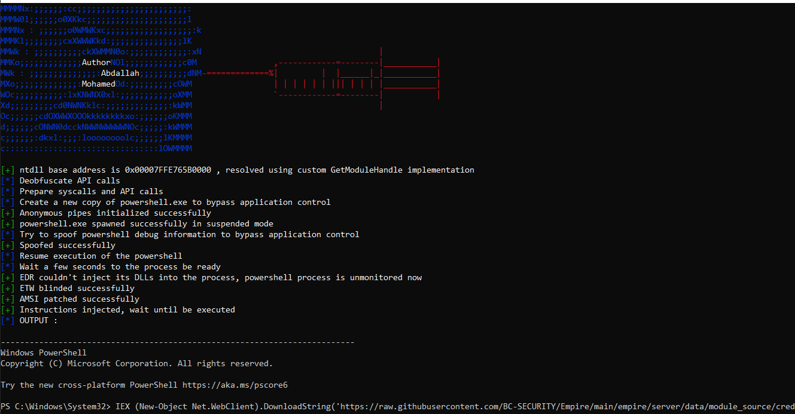
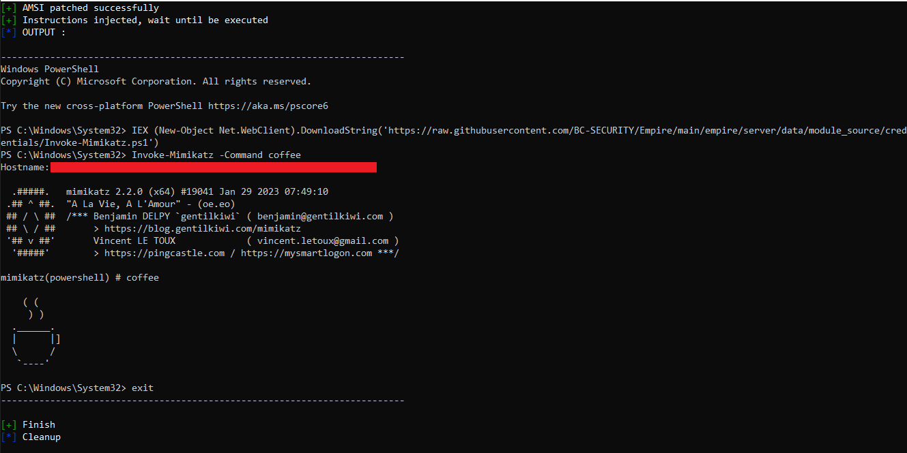
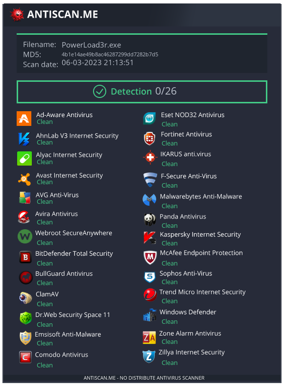

# About 
My POC for malicious powershell scripts loader designed to bypass security controls and avoid detection using advanced evasion techniques, it developed in C and assembly language, for fun and educational purposes.

## Features
- Hell's gate and Halo gate syscaller
- Switch to Veles' Reek technique (in case all syscalls were hooked, and hell's gate and halo gate failed)
- Protecting powershell process from AV/EDRs via block any non-microsoft signed DLLs
- Bypass application control even if EDR could monitor the remote process (powershell maybe blocked by EDR)
- Detecting EDR userland hooks in the remote process, and remove them in case EDR was able to inject its hooks into powershell process
- Bypass AMSI (Anti Malware Scanner Interface)
- Hiding powershell instructions using anonymous pipes
- No RWX
- API calls and syscalls hash obfuscation
- Custom implementation for GetModuleHandle/GetProcAddress in assembly
- Blinding ETW (Event Tracing for Windows)

## Preview

## Anti scan me result
